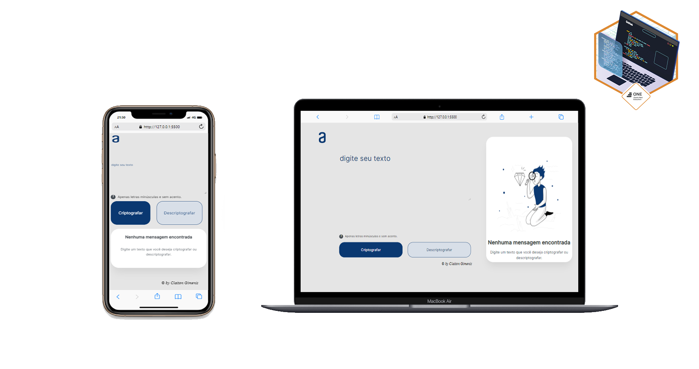

# Alura Decoder

Este é um projeto HTML, CSS e JavaScript de uma página web que permite criptografar e descriptografar mensagens de texto. Foi criado como parte de um curso da plataforma Alura.

## Screenshots  
  

## Instalação

Para utilizar o projeto, basta clonar este repositório ou baixar o código-fonte em um arquivo zip. 

## Uso

Ao abrir o arquivo `index.html` em um navegador, o usuário terá acesso à página web do projeto. Na caixa de texto na parte superior da página, é possível digitar uma mensagem de texto para criptografar ou descriptografar. As únicas letras aceitas são minúsculas e sem acento. Depois de digitar a mensagem, basta clicar no botão "Criptografar" ou "Descriptografar" para obter o resultado na caixa de texto abaixo.

## Estrutura do Projeto

O projeto é composto pelos seguintes arquivos:

- `index.html`: o arquivo HTML principal do projeto, que contém a estrutura da página;
- `reset.css`: um arquivo CSS que define alguns estilos básicos para a página;
- `style.css`: um arquivo CSS que define os estilos específicos da página;
- `script.js`: um arquivo JavaScript que define as funções de criptografia e descriptografia.

## Tecnologias Utilizadas

- HTML
- CSS
- JavaScript

## Autor

Este projeto foi desenvolvido por Claiton Gimenis como parte do curso de "JavaScript: da Alura.
  
  
    